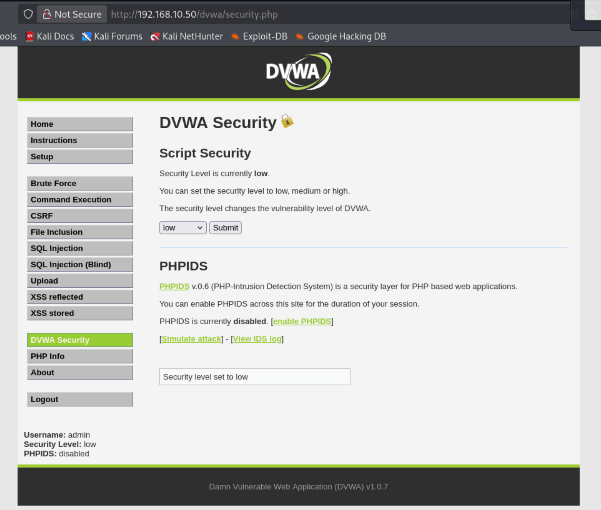
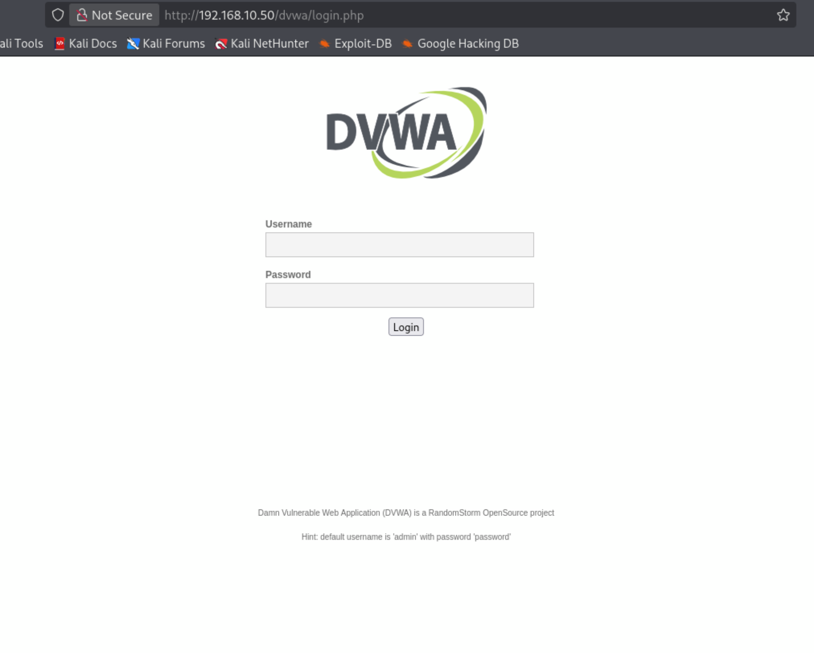
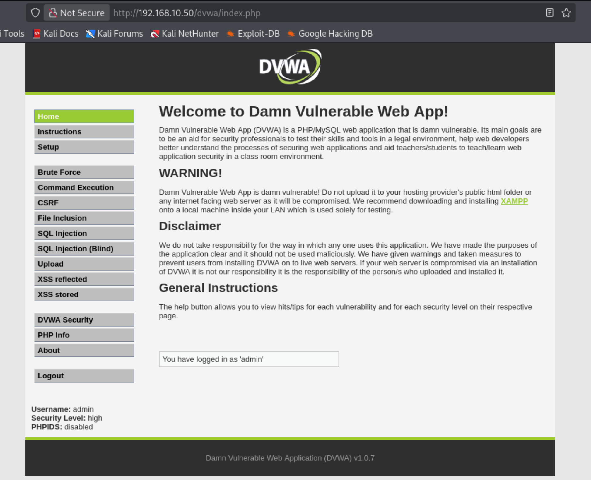

# ⚔️ Attack Phase 1: Methodology (Steps)

---

## 🎯 Objective
To perform web application penetration testing on DVWA and identify common vulnerabilities based on OWASP Top 10.

---

## 🧭 Lab Setup
- Attacker Machine: Kali Linux (192.168.10.5)
- Target Machine: Metasploitable2 (192.168.10.50)
- Web Application: DVWA

---

## 🌐 Accessing DVWA
- Open browser in Kali Linux                                                                                                            
- Navigate to:                                                                                                                       
  http://192.168.10.50/dvwa                                                                                                             
                                                                                                                                     
- Login using:                                                                                                                          
  Username: admin                                                                                                                      
  Password: password                                                                                                                    
  
### ⚙️ Security Level (Low)

- Set Security Level to Low:                                                                                                            
  DVWA Security → Low
  
  
                                                                                                                    
                                                                                                                                        
---

## 📸 DVWA Access Screenshots

### 🔐 Login Page

### 🖥️ Dashboard

---

## 🔥 Attacks Performed
The following vulnerabilities were identified and tested:

1. SQL Injection
2. Cross-Site Scripting (XSS) – Reflected & Stored
3. Command Injection
4. Brute Force Attack (Hydra)
5. File Inclusion (LFI)
6. Cross-Site Request Forgery (CSRF)
7. File Upload (Remote Code Execution)

---

## ✅ Conclusion
The DVWA application was successfully accessed and configured for testing. A structured approach was followed to identify and perform multiple web-based attacks covering key vulnerabilities from the OWASP Top 10.
